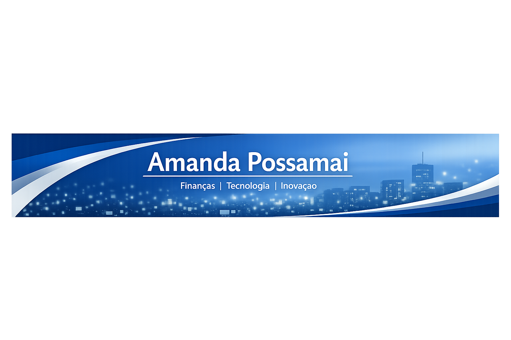

  

---

## Sobre Mim
Olá! Sou **Amanda Possamai**, apaixonada por finanças, tecnologia e inovação.  
Minha trajetória começou no universo das finanças, mas logo percebi que a tecnologia poderia abrir caminhos totalmente novos.  
Desde então, venho buscando inspiração em livros, artigos e pessoas que compartilham conhecimento, além de participar de cursos, mentorias e bootcamps.  

Hoje, meu objetivo é unir **conhecimento técnico e visão estratégica** para criar soluções que simplifiquem processos, tragam eficiência e promovam inovação.  
Este portfólio é o espaço onde compartilho minhas experiências, aprendizados e projetos em construção — uma jornada que está apenas começando, mas já cheia de descobertas.

---

## 📖 Publicações Destacadas

### Estudo de Caso: Da Mentoria à Tecnologia
**Contexto:**  
Durante minha jornada em finanças, percebi o impacto transformador da tecnologia na criação de soluções inovadoras.

**Ação:**  
Queria fazer parte dessa inovação e passei a buscar inspiração em outras pessoas — através de livros, artigos e experiências compartilhadas.  
Comecei o curso de **Desenvolvimento de Sistemas**, participei de **mentorias e bootcamps**, e até escrevi um **artigo na plataforma DIO** falando sobre essa experiência:  
[Da Mentoria à Tecnologia: Uma Nova Visão de Liderança](https://dio.me/articles/da-mentoria-a-tecnologia-uma-nova-visao-de-lideranca-0d79ec57b302)

**Resultado:**  
Essa experiência me ajudou a ampliar minha visão sobre como a tecnologia pode transformar a área de finanças e abrir novas possibilidades profissionais.  
Além disso, escrever e compartilhar meu artigo na DIO foi uma forma de consolidar o aprendizado e trocar ideias com outras pessoas que também estão nessa jornada de inovação.

---

## 🚀 Projetos em Desenvolvimento

- **Automação de Processos Financeiros**  
  Quero explorar como a tecnologia pode simplificar rotinas e trazer mais eficiência para o dia a dia das finanças. É um projeto que nasce da vontade de transformar tarefas repetitivas em soluções inteligentes.

- **Dashboard de Análise de Dados**  
  Estou planejando criar visualizações estratégicas que ajudem a enxergar padrões e tomar decisões mais claras. Esse projeto reflete meu interesse em unir números e insights de forma prática.

- **Integração entre Mentoria e Tecnologia**  
  Acredito que inovação também acontece quando compartilhamos conhecimento. Por isso, quero desenvolver iniciativas que conectem aprendizado, colaboração e ferramentas digitais, mostrando como a tecnologia pode potencializar a troca entre pessoas.

---

## 🌐 Conecte-se Comigo
[LinkedIn](https://www.linkedin.com/in/amanda-serpa-possamai/) • [DIO](https://web.dio.me/users/meylinacs)

---
